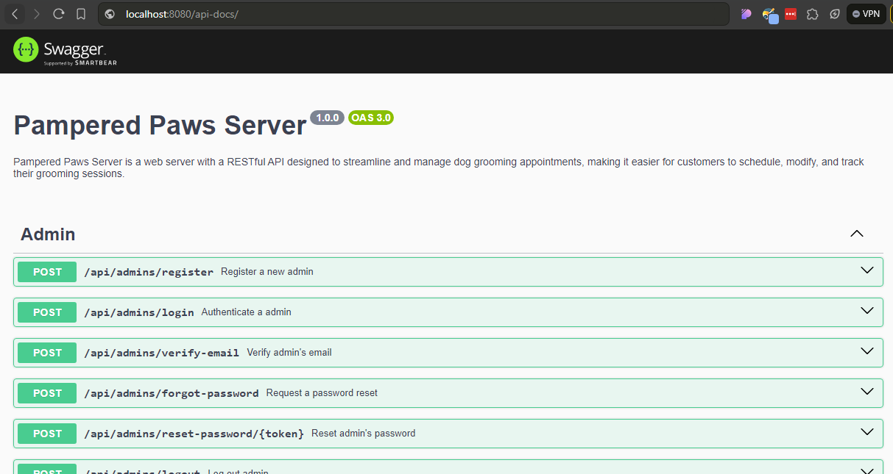

# Pampered Paws Server

Pampered Paws Server is a web server with a RESTful API designed to streamline and manage dog grooming appointments, making it easier for customers to schedule, modify, and track their grooming sessions.

## Features

✅ Authentication & Authorization with JWT

✅ Email sending with Mailtrap

✅ Swagger for API documentation

✅ Validation with Zod

✅ Linting and formatting with ESLint and Prettier

✅ Testing with Jest and Supertest

✅ Commit hooks with Husky

✅ Automates building, linting, formatting, and testing using GitHub Actions

✅ Logging with Winston

✅ Ensures consistent file naming conventions

## Swagger API Documentation

Access the interactive Swagger UI for exploring and testing the API endpoints.

`GET /api-docs`

## Scripts

Following are the list of predefined scripts available in the app

| Script Name  | Description                                           | Command                |
| ------------ | ----------------------------------------------------- | ---------------------- |
| start        | Starts the application with `nodemon`                 | `npm run start`        |
| lint         | Lints the files using ESLint                          | `npm run lint`         |
| lint:fix     | Lints and fixes files using ESLint                    | `npm run lint:fix`     |
| prettier     | Checks the format of files using Prettier             | `npm run prettier`     |
| prettier:fix | Formats files using Prettier                          | `npm run prettier:fix` |
| format       | Formats files using Prettier and ESLint               | `npm run format`       |
| test         | Runs tests using Jest and Supertest                   | `npm run test`         |
| commit       | Opens Commitizen for standardized commit messages     | `npm run commit`       |
| postinstall  | Installs Husky hooks after dependencies are installed | `npm run postinstall`  |
| prepare      | Prepares Husky for Git hooks                          | `npm run prepare`      |
